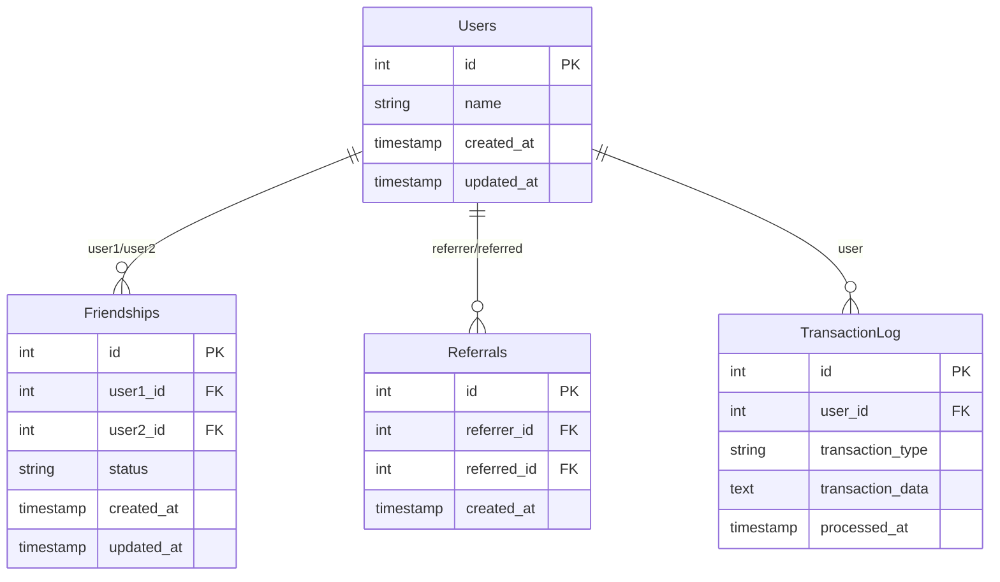

# Bacefook

Zentry Backend Assignment

- Analytics Page: Done
- User Profile: Not Start
- Performance ~ 50k transactions / 5 seconds (on my own local)

## Overall Design

Bacefook is built as a **monorepo application** that provides network relationship visualization and analytics. The platform allows users to explore social connections through an interactive graph interface.

### Architecture

```
┌─────────────────┐    ┌─────────────────┐    ┌─────────────────┐
│   Frontend      │    │   Backend API   │    │   Database      │
│   (Next.js)     │◄──►│   (Next.js)     │◄──►│   (PostgreSQL)  │
│   Port 3000     │    │   Port 3001     │    │   Port 5432     │
└─────────────────┘    └─────────────────┘    └─────────────────┘
```

### Key Features

- **Network Visualization**: Interactive D3.js graph showing user relationships
- **Relationship Types**: 
  - **Friendships**: Bidirectional social connections (green)
  - **Referrals**: Directional referral relationships (orange arrows)
- **User Search**: Find and visualize any user's network
- **Real-time Data**: Direct database integration for live relationship data

### Data Model



## Stack & Framework

### Monorepo Structure

- **[Turborepo](https://turborepo.com/)**: Monorepo build system for managing multiple apps and packages
- **TypeScript**: Full type safety across all applications
- **ESLint & Prettier**: Code quality and formatting

### Applications

#### Frontend (`apps/web`)

- **[Next.js 15](https://nextjs.org/)**: React framework with App Router
- **[React 19](https://react.dev/)**: UI library with latest features
- **[D3.js](https://d3js.org/)**: Data visualization library for interactive network graphs
- **[Tailwind CSS](https://tailwindcss.com/)**: Utility-first CSS framework

#### Backend (`apps/api`)

- **[Next.js 15](https://nextjs.org/)**: API routes for backend services
- **[Prisma ORM](https://prisma.io/)**: Type-safe database client and migration tool
- **Custom NetworkService**: Simplified ORM layer for network operations
- **CORS Support**: Cross-origin resource sharing for frontend integration

### Database & Infrastructure

- **[PostgreSQL](https://postgresql.org/)**: Primary database for storing user relationships
- **[Docker Compose](https://docs.docker.com/compose/)**: Container orchestration for development
- **Environment Configuration**: Secure database connection management

### Development Tools

- **[Jest](https://jestjs.io/)**: Testing framework with TypeScript support
- **Test Coverage**: Unit tests for database, service layer, and API endpoints
- **Hot Reload**: Development servers with live code updates

### Shared Packages

- **`@repo/ui`**: Shared React components
- **`@repo/eslint-config`**: Shared ESLint configurations
- **`@repo/typescript-config`**: Shared TypeScript configurations

## Setup

### Prerequisites

- docker
- node v18+

### Install Dependencies and set environment

1. Make sure you are in bacefook directory and install all required dependencies

    ```bash
    npm install turbo --global
    ```

    ```bash
    cd bacefook
    npm install
    ```

2. Start PostgreSQL and Redis containers using docker compose

    ```bash
    docker-compose up -d
    ```

3. Copy .env.example file to .env file for each application

    ```bash
    cp ./apps/api/.env.example ./apps/api/.env
    cp ./apps/consumer/.env.example ./apps/consumer/.env
    cp ./apps/worker/.env.example ./apps/worker/.env
    ```

4. Generate Types from Prisma schema for `api` and `worker` -- Note: this could be shared module IMO.

    ```bash
    cd apps/api
    npm run db:generate
    ```

    ```bash
    cd ../worker
    npm run db:generate
    npm run db:migrate --y
    ```

5. Try compile the whole project

    ```bash
    # Go back to /bacefook
    cd ../../
    npm run build
    ```

We should be able to continue on testing now

## Demo

I recommend to generate a small amount of data to test Analytics Page Feature first.

After that, we can test the performance of worker (consuming event to DB) later

### Analytics Page Testing

1. Make sure your PostgreSQL and Redis containers are still running.
2. Make sure you're at `/bacefook` directory and start every app via turbo to generate some data for ~10 seconds

   ```bash
   npm run dev
   ```

3. stop the applications using `Ctrl + C`
4. start `api` service

   ```bash
    cd ./apps/api
    npm run dev
   ```
5. start `web` service using new terminal
   ```bash
   cd bacefook/apps/web
   npm run dev
   ```
6. Go to http://localhost:3000/
7. Click View Network Relationships
8. Put sample user i.e., `user00001` and click search

### Performance Testing

1. Make sure your PostgreSQL and Redis containers are still running.
2. Make sure you're at `/bacefook` directory
3. Edit your `/bacefook/apps/worker/.env` to have more larger batch size / worker concurrency.

   **Known issue - recommend using only 1 worker to avoid db deadlock**

   ```text
    BATCH_SIZE=10000
    WORKER_CONCURRENCY=1
    QUEUE_NAME=transactions
   ```

4. Edit your `/bacefook/apps/consumer/.env` to have more larger batch size / worker concurrency.

   ```text
    PRODUCER_NEW_USER_BATCH_SIZE=1000
    INTERVAL=5000
    QUEUE_NAME=transactions
   ```
   
5. Start application via terminal

   ```bash
   cd bacefook
   npm run dev
   ```
   
6. monitor performance in worker task

### Unit Testing

```bash
# Run all tests
npm run test
```

## Project Structure

```
bacefook/
├── apps/
│   ├── api/                    # Backend API service
│   │   ├── app/api/network/    # Network relationship endpoints
│   │   ├── lib/                # Database and service layer
│   │   └── __tests__/          # API tests
│   └── web/                    # Frontend application
│       ├── app/network/        # Network visualization page
│       └── components/         # Shared UI components
├── packages/
│   ├── eslint-config/          # Shared ESLint configurations
│   ├── typescript-config/      # Shared TypeScript configurations
│   └── ui/                     # Shared React components
└── docker-compose.yml          # Development environment setup
```

## API Endpoints

### Network API
- **GET** `/api/network/[name]` - Retrieve user network data including friends and referrals
- **OPTIONS** `/api/network/[name]` - CORS preflight handling

### Response Format
```json
{
  "user": {
    "id": 1,
    "name": "user1",
    "createdAt": "2023-01-01T00:00:00.000Z"
  },
  "friends": [
    {
      "id": 2,
      "name": "friend1", 
      "status": "ACTIVE",
      "createdAt": "2023-01-02T00:00:00.000Z"
    }
  ],
  "referrals": {
    "given": [
      {
        "id": 3,
        "name": "referred1",
        "referredAt": "2023-01-03T00:00:00.000Z"
      }
    ],
    "received": [
      {
        "id": 4,
        "name": "referrer1", 
        "referredAt": "2023-01-04T00:00:00.000Z"
      }
    ]
  }
}
```
